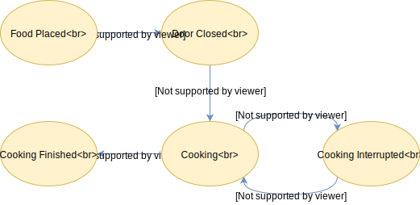

# State Machine

Project aims building `Finite State Machine` with a human friendly dsl in Kotlin, Java, Groovy.

## Installation

It is ready to go after adding the JitPack repository and project dependency to your build file!


**Gradle :** 

~~~groovy
allprojects {
    repositories {
        ...
        maven { url 'https://jitpack.io' }
    }
}

dependencies {
    compile 'com.github.hasanguner:state-machine:0.2.1'
}
~~~

**Maven :** 

~~~xml

 <repositories>
    <repository>
        <id>jitpack.io</id>
         <url>https://jitpack.io</url>
    </repository>
 </repositories>
...
 <dependency>
    <groupId>com.github.hasanguner</groupId>
    <artifactId>state-machine</artifactId>
    <version>0.2.1</version>
</dependency>
~~~


## How does it work ?

It provides building _state machines_ in a human-friendly way with power of the Kotlin DSL.
It validates transition definitions when the state machine triggered and then proceeds the defined action if it is presented.

## Demo - (`Microwave Oven`)

Here is the demonstration of cooking foods in the microwave.



**Firstly,** we are defining the `State` and `Event`

~~~kotlin
enum class State {
    FOOD_PLACED,
    DOOR_CLOSED,
    COOKING,
    COOKING_INTERRUPTED,
    COOKING_FINISHED
}

enum class Event {
    CLOSE_DOOR,
    SET_TIMER,
    OPEN_DOOR,
    TIME_IS_UP
}
~~~

**Then,** we are defining the state machine

~~~kotlin
  
  val stateMachine = StateMachine.withEntry<State, Event>(State.FOOD_PLACED) {

        (shouldMove() from State.FOOD_PLACED to State.DOOR_CLOSED).on(Event.CLOSE_DOOR) {
            println("Door closed.")
        }

        (shouldMove() from State.DOOR_CLOSED to State.COOKING).on(Event.SET_TIMER) {
            println("Cooking started.")
        }

        (shouldMove() from State.COOKING to State.COOKING_INTERRUPTED).on(Event.OPEN_DOOR) {
            println("Cooking interrupted.")
        }

        (shouldMove() from State.COOKING_INTERRUPTED to State.COOKING).on(Event.CLOSE_DOOR) {
            println("Cooking continues.")
        }

        (shouldMove() from State.COOKING to State.COOKING_FINISHED).on(Event.TIME_IS_UP) {
            println("Cooking finised.")
        }

    }
~~~

**Lets run it!**

~~~kotlin
    println("-Initial State : [${stateMachine.currentState}]")

    println("*Closing door..")
    stateMachine.evaluate(Event.CLOSE_DOOR)
    println("*Setting timer..")
    stateMachine.evaluate(Event.SET_TIMER)

    println("-A little naughtiness :)")
    repeat(2) {
        //naughty developer actions..
        println("*Opening door..")
        stateMachine.evaluate(Event.OPEN_DOOR)
        println("*Closing door..")
        stateMachine.evaluate(Event.CLOSE_DOOR)
    }
    println("-Okay, let's let it cook")
    println("*Time is up..")
    stateMachine.evaluate(Event.TIME_IS_UP)

    println("-Final State : [${stateMachine.currentState}]")
~~~

Output:

```
-Initial State : [FOOD_PLACED]
*Closing door..
Door closed.
*Setting timer..
Cooking started.
-A little naughtiness :)
*Opening door..
Cooking interrupted.
*Closing door..
Cooking continues.
*Opening door..
Cooking interrupted.
*Closing door..
Cooking continues.
-Okay, let's let it cook
*Time is up..
Cooking finised.
-Final State : [COOKING_FINISHED]
```
 
## Tests

You can build the project and run all tests.

```
./gradlew test

```